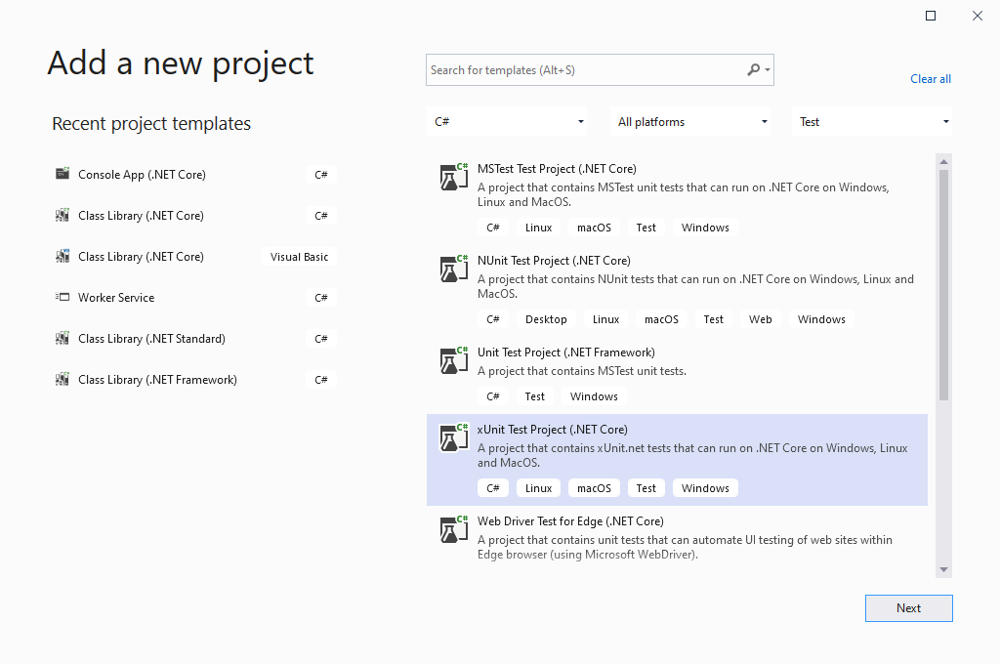
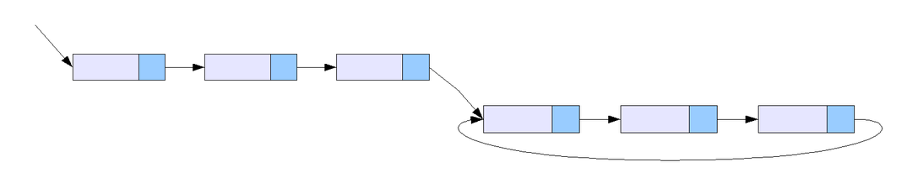
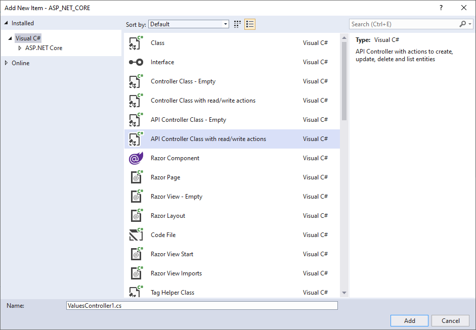
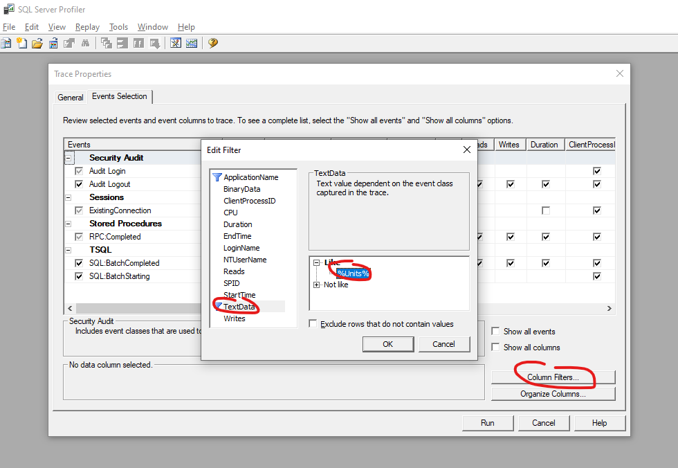
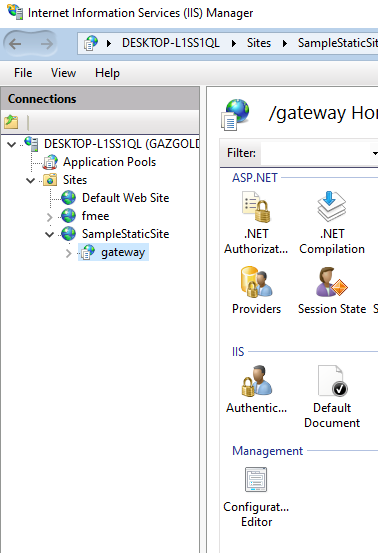

# О проекте

Данный репозиторий содержит материалы для обучения программированию на платформе .NET на языке C#, с упором на веб-разработку (ASP NET Core), и изучением сопутствующих технологий и стандартов. Рекомендуется проходить курс под руководством ментора, но возможно и самостоятельное изучение.

> Настоятельно рекомендуется использовать систему контроля версий git как для работы над проектами,
> так и для выполнения заданий в этом курсе.
> Для этого создайте свой репозиторий на GitHub, и выполняйте в нём задания.  
> Если обучение проходит под руководством ментора, оформляйте выполненные задания в виде
> `merge request`'ов (aka `pull request`) - запрос на вливание кода из рабочей ветки в основную (master/main). Более подробно о работе с GitHub см. примечание в [Уроке 1](#урок-0-работа-с-классами-вывод-сообщений-в-консоль)
> Рекомендованный GUI-клиент - [GitHub Desktop](https://desktop.github.com) или встроенные инструменты в Visual Studio.

Первоначально материалы составлены [Ильей Доценко](https://github.com/dontbesilly) и [Деевым Андреем](https://github.com/navferty) в 2020 году.

# Введение

Язык C# (си-шарп) - один из популярных языков программирования, который широко используется в бэкенд-разработке, создании десктопных приложений (как под ОС Windows, так и кроссплатформенных). Он появился в 2000 году в составе .NET Framework, который поддерживался только в операционной системе Windows. Однако в 2015 году появилась платформа .NET Core, которая поддерживается на всех популярных ОС (Windows, Linux, Mac OS). .NET Core развивался параллельно со старым .NET Framework, но в 2020 году произошло их объединенение под названием .NET 5 (актуальная версия платформы - .NET 6, он вышел в конце 2021 года).

Широкое распространение языка C# обусловило совершенствование инструментов и библиотек (в том числе с открытым исходным кодом): Visual Studio признаётся одной из лучших сред разработки, фреймворки ASP.NET Core и Entity Framework открывают много возможностей при написании веб-приложений. Активное и многочисленное сообщество, различные конференции и митапы, множество обучающей литературы и курсов - всё это поможет начинающему программисту освоить этот язык.

# Темы для самостоятельного изучения

В данном разделе приведены темы, которые рекомендуются изучить самостоятельно, путём чтения литературы по ссылкам, а также поиском информации в интернете. Умение "гуглить" - важный навык для программиста.

## Теория

 * Сложность алгоритмов, нотация О-большое. Иметь представление об алгоритмах сортировки (пузырьком, слиянием и т.п.). Рекомендуется пройти курс [Оценка сложности алгоритмов](https://ulearn.me/Course/complexity/Zachem_mne_eto__f5e3d1fe-09aa-4403-9fb2-e175b40577ae) на ulearn.me
 * Структуры данных - массивы, одно- и двусвязные списки, деревья (бинарные, красно-черные), хэш-таблицы. [Неплохая обзорная статья](https://habr.com/en/company/netologyru/blog/334914) по структурам данных.
 * Реализация структур данных в BCL: пространства имен `System.Collections` и `System.Collections.Generic` - какие структуры лежат в основе этих классов (Array, List, HashSet, Dictionary), [выбор нужного типа коллекции](https://docs.microsoft.com/ru-ru/dotnet/standard/collections/selecting-a-collection-class) для конкретной задачи
 * Знакомство с алгоритмами: сортировка массива ([пузырьковая](https://ru.wikipedia.org/wiki/Сортировка_пузырьком), [слиянием](https://ru.wikipedia.org/wiki/Сортировка_слиянием), [быстрая](https://ru.wikipedia.org/wiki/Быстрая_сортировка)), [решето Эратосфена](https://ru.wikipedia.org/wiki/Решето_Эратосфена)
* \* Самостоятельная реализация алгоритмов из предыдущего пункта на C#

## Материалы для самостоятельного изучения:
1. [Краткий обзор языка C#](https://docs.microsoft.com/dotnet/csharp/tour-of-csharp/index)
1. Jeffrey Richter "CLR via C#"
2. Для самостоятельной тренировки Git: [learngitbranching.js.org](https://learngitbranching.js.org/?locale=ru_RU)

## Туториалы базового уровня
1. https://ulearn.me/
1. https://docs.microsoft.com/dotnet/core/get-started
1. https://docs.microsoft.com/aspnet/core

## Язык C# и платформа .NET

Если Вы только начинаете знакомство с программированием на языке C#, необязательно глубоко погружаться в перечисленные ниже темы. Тем, кто совсем не знаком с языком, рекомендуется пройти [Главу 2. Основы программирования на C#](https://metanit.com/sharp/tutorial/1.5.php). Также можно пройти туториал [первые шаги с помощью C#](https://docs.microsoft.com/learn/paths/csharp-first-steps) от Microsoft.

Тем же, кто успел освоить базовый уровень языка, и хочет изучить его на более глубоком уровне, будет полезным иметь представление об этих понятиях:

 * Generics (обобщения). Какие можно использовать ограничения на обобщенный тип (generic constraints)? Как работают in и out (ковариантность и контрвариантность)?
 * Лямбды. Что такое и зачем нужно?
 * Extension методы. Что это такое, как их использовать? Какое ключевое слово показывает, что метод является методом расширения?
 * Boxing/unboxing - что такое, какие могут быть проблемы с ним связанные.
 * История платформы .NET; старый .NET Framework vs актуальный .NET (бывший .NET Core).
 * Файл csproj - зачем он нужен, его структура и возможности. SDK-style vs старая схема.
 * async/await. Что такое асинхронный вызов, чем он отличается от синхронного. В чем преимущество асинхронного вызова продлжительной операции, например сетевого запроса или тяжелых вычислений?
 * Использование Task и Task\<TResult\> в асинхронном программировании. Это [рекомендуемый способ](https://docs.microsoft.com/dotnet/standard/asynchronous-programming-patterns/task-based-asynchronous-pattern-tap) реализации асинхронных операций.
 * Вопрос со звездочкой. Что общего у асинхронного метода и у метода-итератора:
<details><summary>Примеры асинхронного метода и метода-итератора</summary>

```csharp
    public async Task<MyData> AsyncMethod()
    {
        // некоторый синхронный код
        var data = GetSomething();

        // асинхронный вызов
        var result = await SomeMethod(data);

        // еще некоторый синхронный код
        var smth = GetSomethingMore();

        return result;
    }

    public IEnumerable<MyData> IteratorMethod()
    {
        var data = GetSomething();
        foreach (var item in data)
        {
            var result = ModifyData(item);
            yield return result;
        }
    }
```

</details>

 * Сборщик мусора. Поколения объектов. LOH. Сколько байт занимает в куче объект, имеющий одно поле типа int (на архитектуре x86, x64)? Что такое sync block index, таблица методов и указатель на неё. [О внутреннем устройстве объектов в памяти](https://m.habr.com/en/post/344556)
 * Поток и процесс. Чем они отличаются в Windows? Из чего состоит поток?

## От теории к практике

Как и в предыдущем пункте, необязательно погружаться в каждую из этих тем. Но уверенное владение указанными понятиями, технологиями и инструментами поможет в работе программиста.

 * JSON - что за формат, какие правила? Чем отличается от XML - преимущества и недостатки. Что такое Newtonsoft Json (на смену которому пришёл System.Text.Json от MS)? Что такое сериализация и десериализация?
 * Кодировки, unicode, utf-8, utf-16. Чем UTF-8 отличается от ASCII, насколько он с ней совместим? Рекомендую начать изучение с прочтения [статьи Джоэла Спольски](https://www.joelonsoftware.com/2003/10/08/the-absolute-minimum-every-software-developer-absolutely-positively-must-know-about-unicode-and-character-sets-no-excuses/). Также что такое little-endian и big-endian?
 * IIS. Что такое, зачем нужен. IIS Express - чем отличается от полной версии.
 * Паттерн MVC. Что означает каждая буква, за что отвечает.
 * Entity Framework. Что это такое, история развития, версии. [Туториал, по использованию EF в ASP.NET](https://docs.microsoft.com/aspnet/core/data/ef-rp/intro)
 * SQL. В продолжение предыдующего пункта, даже с использованием EF, всё равно не обойтись без SQL. [Неплохой туториал по основам SQL](https://www.w3schools.com/sql)
 * Регулярные выражения. Движки регулярных выражений ("регулярок") есть в разных языках, так что можно использовать их как в C#, так и в JS. А также, например, в текстовых редакторах при поиске текста (в том же VS Code). О регулярках [хорошо написано на learn.javascript.ru](https://learn.javascript.ru/regexp-introduction), а для их отладки удобно пользоваться [regex101.com](https://regex101.com) (вообще крутой сайт, в закладки!).
 * HTTP:
   - методы (какие бывают, какая семантика у каждого из них). Чем отличается GET и POST методы?
   - заголовки (что это, зачем и как используется. Часто используемые заголовки: Authorization, Set-Cookie, Content-Type, Access-Control-Allow-Origin)
   - тело запроса (что может содержать)
 * REST API. Основные принципы проектирования API, соответствующего REST.
 * Ещё немного про функционирование веба - Сетевая модель OSI: https://ru.wikipedia.org/wiki/Сетевая_модель_OSI
Эта модель скорее для справки, и понимания общего контекста, так как в настоящее время не всегда соответствует действительности - но хорошо демонстрирует уровни абстраций.
 * Протоколы TCP, UDP. Основные принципы и отличия
 * HTTP/HTTPS - сертификаты, корневые центры. Зачем нужен HTTPS, от чего позволяет защищаться.
 * IPv4, IPv6
 * Веб-сокеты. Как происходит установление соединения. Принципы использования.
Можно потренировться на https://www.websocket.org/echo.html (найти ws соединение на вкладке Network в Chrome DevTools, открыть список сообщений)
 * [Unit-тесты](https://ru.wikipedia.org/wiki/Модульное_тестирование). Методика, используемая при тестировании приложений или отдельных его частей. Наличие тестов даёт сразу несколько преимуществ: возможность быстро проверять работоспособность внесенных в код изменений, а также способ показать спецификациию метода(-ов) класса (какие входные параметры ожидает этот метод, и что остальные компоненты системы ждут от него на выходе). Кроме того, при использовании систем автоматизированной сборки проекта ([CI/CD](https://about.gitlab.com/topics/ci-cd/)) можно выполнять автоматический запуск тестов при внесении изменений в код проекта.
 * [Fluent Assertions](https://fluentassertions.com/introduction). Библиотека позволяющая писать более читабельные тесты при Unit-тестировании, а так же видеть более детальную информацию где и как произошла ошибка, если тест был не пройден.

## Javascript

Язык программирования JavaScript используется, как правило, для программирования логики, которая должна исполняться в браузере на клиентском устройстве. Тем не менее, даже для бэкенд разработчика, который пишет логику серверной части приложения, знакомство с этим языком будет существенным плюсом.

 * Хоршоший учебник по JS: [learn.javascript.ru](https://learn.javascript.ru/)
    - Из [первой части](https://learn.javascript.ru/js) (Язык JavaScript) первые две главы обязательно, с 3 по 6 рекомендуется. Особое внимание [главе про отладку в браузере Chrome](https://learn.javascript.ru/debugging-chrome): научитесь использовать точки останова, выводить данные в консоль, пошагово исполнять JS-код.
    - Из [второй части](https://learn.javascript.ru/ui) (Документ, события, интерфейсы) [первая глава](https://learn.javascript.ru/document) обязательно, дальше желательно.
    - Из прочих разделов, "CSS для JavaScript-разработчика" желательно.
 * Принцип "знай свой инструмент".
Возможности VS Code - полезные сочетания клавиш, наиболее популярные и полезные расширения
(для отладки JS кода, для поддержки синтаксиса языка и рефакторинга, для интеграции с системами контроля версий, и многие другие)

# Урок 0. Работа с классами, вывод сообщений в консоль

В этом уроке Вам предстоит создать несколько классов, отражающих объекты реального мира (резервуар, установка, завод), а также использовать основные операторы языка: условные операторы, циклы, вызов методов и использование возвращаемых из них результатов.

Для выполнения задания склонируйте к себе на компьютер созданный на GitHub репозиторий, создайте там новый solution (это можно сделать в Visual Studio) с консольным C# приложением. Следующие уроки Вам предстоит выполнять, добавляя новые приложение в этом solution'е или дорабатывая приложения из предыдущих уроков.

<details>
  <summary>Как начать работу в git-репозитории на GitHub</summary>

    0. Создать новый публичный репозиторий (рекомендуется сразу поставить галочку `Initilaize with Readme.md`, а также добавить .gitignore-файл по шаблону Visual Studio)
    1. [Клонировать](https://docs.microsoft.com/visualstudio/version-control/git-clone-repository) к себе на компьютер этот репозиторий ([используя GUI-клиент](https://docs.github.com/en/desktop/contributing-and-collaborating-using-github-desktop/adding-and-cloning-repositories/cloning-and-forking-repositories-from-github-desktop) на выбор или встроенный в Visual Studio)
    2. В папке репозитория создать новый солюшн с консольным приложением на C# (в Visual Studio)
    3. Выполнить задание соответствующего урока
    4. Закоммитить свои изменения (не забыв добавить .gitignore если его нет, чтобы в репозиторий попали только файлы с исходным кодом, а не бинари)
    5. Сделать push в удалённый (remote) репозиторий, чтобы изменения были опубликованы на GitHub

    Если Вы проходите обучение под руководством ментора, первое задание допустимо выполнить, сделав коммит напрямую в ветке по умолчанию. При выполнении последующих заданий, процесс проверки ДЗ желательно проводить посредством код-ревью. Вместо того, чтобы коммитить напрямую в основной ветке, нужно предварительно создать от неё новую локальную ветку, закоммитить в этой ветке и запушить. После этого на гитхабе [создать мерж-реквест](https://docs.gitlab.com/ee/user/project/merge_requests/creating_merge_requests.html#when-you-use-git-commands-locally), который отправить на ревью.
</details>

## Темы

1. [Типы данных](https://docs.microsoft.com/dotnet/csharp/fundamentals/types)
1. [Циклы, условные операторы](https://docs.microsoft.com/dotnet/csharp/tour-of-csharp/tutorials/branches-and-loops-local)
1. [Классы](https://docs.microsoft.com/dotnet/csharp/language-reference/keywords/class), [методы](https://docs.microsoft.com/dotnet/csharp/programming-guide/classes-and-structs/methods) (a.k.a. функции), [свойства](https://docs.microsoft.com/dotnet/csharp/programming-guide/classes-and-structs/properties) (и, в частности, [автосвойства](https://docs.microsoft.com/dotnet/csharp/programming-guide/classes-and-structs/auto-implemented-properties)), [поля](https://docs.microsoft.com/dotnet/csharp/programming-guide/classes-and-structs/fields)
1. Основы ООП
1. Работа с коллекциями, строками

## Задания

<details>
  <summary>Таблицы Factories (заводы), Units (установки), Tanks (резервуары)</summary>

| Id | Name | Description                            |
|----|------|----------------------------------------|
| 1  | НПЗ№1 | Первый нефтеперерабатывающий завод    |
| 2  | НПЗ№2 | Второй нефтеперерабатывающий завод    |

| Id | Name   | Description                      | FactoryId |
|----|--------|----------------------------------|-----------|
| 1  | ГФУ-2  | Газофракционирующая установка    | 1         |
| 2  | АВТ-6  | Атмосферно-вакуумная трубчатка   | 1         |
| 3  | АВТ-10 | Атмосферно-вакуумная трубчатка   | 2         |

| Id | Name                        | Description                | Volume | MaxVolume | UnitId |
|----|-----------------------------|----------------------------|--------|-----------|--------|
| 1  | Резервуар 1                 | Надземный - вертикальный   | 1500   | 2000      | 1      |
| 2  | Резервуар 2                 | Надземный - горизонтальный | 2500   | 3000      | 1      |
| 3  | Дополнительный резервуар 24 | Надземный - горизонтальный | 3000   | 3000      | 2      |
| 4  | Резервуар 35                | Надземный - вертикальный   | 3000   | 3000      | 2      |
| 5  | Резервуар 47                | Подземный - двустенный     | 4000   | 5000      | 2      |
| 6  | Резервуар 256               | Подводный                  | 500    | 500       | 3      |

</details>

1. Создать классы, описывающие структуру каждой из приведённых выше таблиц
1. Создать экзепляры объектов из таблицы. Вы можете создавать объекты с помощью `new`, прямо в коде определив значения из приложенных таблиц. По желанию, можно реализовать чтение и десериализацию из json-файлов (потребуется продумать структуру и подготовить json файлы с указанными в таблицах данными)
1. Реализовать функции, возвращающие результат согласно комментариям
    - если Вы начинающий программист, используйте циклы, условные операторы и оператор switch
    - eсли Вы больше уверены в своих навыках, используйте LINQ для более лаконичных запросов при фильтрации, выборе или суммировании значений
1. Осуществить вывод в консоль всех резервуаров, включая имена цеха и фабрики, в которых они числятся
1. Вывести общую сумму загрузки всех резервуаров
1. \* Осуществить возможность поиска по наименованию в коллекции, например через ввод в консоли
1. \** Придумать структуру и выгрузить все объекты в json файл
1. \*** Считать данные таблиц Excel напрямую, используя любую библиотеку

За основу можно взять код ниже:
<details><summary>Пример кода</summary>

```csharp
class Program
{
  static void Main(string[] args)
  {
    var tanks = GetTanks();
    var units = GetUnits();
    var factories = GetFactories();
    Console.WriteLine($"Количество резервуаров: {tanks.Length}, установок: {units.Length}");

    var foundUnit = FindUnit(units, tanks, "Резервуар 2");
    var factory = FindFactory(factories, foundUnit);

    Console.WriteLine($"Резервуар 2 принадлежит установке {foundUnit.Name} и заводу {factory.Name}");

    var totalVolume = GetTotalVolume(tanks);
    Console.WriteLine($"Общий объем резервуаров: {totalVolume}");
  }

  // реализуйте этот метод, чтобы он возвращал массив резервуаров, согласно приложенным таблицам
  // можно использовать создание объектов прямо в C# коде через new, или читать из файла (на своё усмотрение)
  public static Tank[] GetTanks()
  {
    // ваш код здесь
  }
  // реализуйте этот метод, чтобы он возвращал массив установок, согласно приложенным таблицам
  public static Unit[] GetUnits()
  {
    // ваш код здесь
  }
  // реализуйте этот метод, чтобы он возвращал массив заводов, согласно приложенным таблицам
  public static Factory[] GetFactories()
  {
    // ваш код здесь
  }

  // реализуйте этот метод, чтобы он возвращал установку (Unit), которой
  // принадлежит резервуар (Tank), найденный в массиве резервуаров по имени
  // учтите, что по заданному имени может быть не найден резервуар
  public static Unit FindUnit(Unit[] units, Tank[] tanks, string unitName)
  {
    // ваш код здесь
  }

  // реализуйте этот метод, чтобы он возвращал объект завода, соответствующий установке
  public static Factory FindFactory(Factory[] factories, Unit unit)
  {
    // ваш код здесь
  }

  // реализуйте этот метод, чтобы он возвращал суммарный объем резервуаров в массиве
  public static int GetTotalVolume(Tank[] units)
  {
    // ваш код здесь
  }
}

/// <summary>
/// Установка
/// </summary>
public class Unit
{
  //..
}

/// <summary>
/// Завод
/// </summary>
public class Factory
{
  //..
}

/// <summary>
/// Резервуар
/// </summary>
public class Tank
{
  //..
}
```
</details>

> Код выполненного задания опубликовать в свой git-репозиторий.  
> Каждое из следующих заданий выполняйте в отдельной ветке этого репозитория, оформляя merge request в основную ветку.  
> При наличии ментора, просите его провести код-ревью, в ходе которого он оставит свои комментарии к Вашему коду, или оставит отметку Approved.

## Материалы

### Руководства

https://metanit.com/sharp/tutorial  
https://docs.microsoft.com/dotnet/csharp/tutorials/intro-to-csharp  
https://docs.microsoft.com/dotnet/csharp/programming-guide  

### Книги

CLR via C# | Джеффри Рихтер  
https://upload.wikimedia.org/wikipedia/commons/b/b3/C_Sharp_Programming.pdf

### Программы

https://visualstudio.microsoft.com/ru  
https://desktop.github.com  
https://code.visualstudio.com

# Урок 1. Часть 1. Парсинг JSON и применение LINQ

## Темы

* [LINQ](https://docs.microsoft.com/dotnet/csharp/programming-guide/concepts/linq/)
* [JSON](https://docs.microsoft.com/dotnet/standard/serialization/system-text-json-how-to)
* [Открытие и чтение текстового файла](https://docs.microsoft.com/troubleshoot/dotnet/csharp/read-write-text-file)

## Задание

Реализовть парсер JSON с коллекцией сделок из текстового файла [JSON_sample_1.json](data/JSON_sample_1.json)

 * Можно использвать `Newtonsoft.Json` или `System.Text.Json`

 * Результат должен быть в виде массива объектов класса Deal:

```csharp
class Deal
{
  public int Sum {get;set;}
  public string Id {get;set;}
  public DateTime Date {get;set;}
}
```

 * Реализовать метод `GetNumbersOfDeals`, который принимает коллекцию объектов класса Deal и:
   - фильтрует по сумме (не меньше 100 рублей) 
   - среди отфильтрованных, берёт 5 сделок с самой ранней датой
   - возвращает номера (поле Id) в отсортированном по сумме по убыванию виде

```csharp
IList<string> GetNumbersOfDeals(IEnumerable<Deal> deals)
{
   ...
}
```

 * Реализовать метод `GetSumsByMonth`, который принимает коллекцию объектов класса Deal, группирует по месяцу сделки и возвращает сумму сделок за каждый месяц

```csharp
// record - это синтаксический сахар для объявления класса (имеет семантику сравнения по значению)
// подробнее https://docs.microsoft.com/en-us/dotnet/csharp/whats-new/tutorials/records
record SumByMonth(DateTime Month, int Sum);

IList<SumByMonth> GetSumsByMonth(IEnumerable<Deal> deals)
{
   ...
}
```

 * Консольное приложение в функции `Main` должно вызывать методы `GetNumbersOfDeals` и `GetSumsByMonth` и выводить в консоль результаты (количество найденных значений, сами идентификаторы через запятую, пары месяц-сумма).

> Реализованное приложение должно быть в отдельной папке в вашем репозитории.
> Вы можете включить его в один solution вместе с приложением, которое Вы создали в прошлом уроке.

# Урок 1. Часть 2. Использование стороннего API. Реализация WebApi на ASP.NET Core, использование websockets

 * Задание: реализовать консольное приложение, которое единственным параметром будет принимать ИНН организации, и печатать название организации, которое оно получит от [сервиса DaData](https://dadata.ru/api/find-party/).
То есть нужно разобраться в их API, зарегистрироваться (сервис бесплатный для небольших масштабов), составить запрос и реализовать это на C#
Рекомендуется установить и использовать Fiddler/Postman или другой аналогичный инструмент.

 * Задание со звёздочкой: реализовать веб-приложение на ASP.NET Core, функционально аналогичное предыдущему заданию, которое будет отдавать ответ по HTTP Get-запросу (ASP.NET Core Web Api)

> ASP.NET Core - это [фреймворк](https://ru.wikipedia.org/wiki/Фреймворк), который помогает разрабатывать веб-приложения. Он даёт каркас приложения, которое может обслуживать http-запросы от клиентов, а также выполнять фоновые задачи. "Из коробки" можно настроить конфигурацию приложения, создать промежуточные обработчики запросов, добавить авторизацию клиентов и многое другое.  
> В следующих уроках Вы научитесь создавать веб-приложение с типовыми операциями чтения/редактирования сущностей в базе данных.

 * Задание со звёздочкой и еще одной звездочкой: дополнить веб-приложение из предыдущего пункта возможностью работы по веб-сокетам (используя SignalR или голые сокеты).
При поступлении входящего сообщения нужно получить имя организации и разослать его *всем* подписчикам.

Ссылки:
* [API-сервис DaData](https://dadata.ru/api/find-party/)
* [Отправка HTTP-запросов из приложения на C#](https://docs.microsoft.com/aspnet/web-api/overview/advanced/calling-a-web-api-from-a-net-client)
* [Использование Fiddler/Postman](https://www.tutorialsteacher.com/webapi/test-web-api)
* [Создание простого WebApi](https://docs.microsoft.com/aspnet/core/tutorials/first-web-api)
* [Использование SignalR](https://docs.microsoft.com/aspnet/core/tutorials/signalr)
* [Использование веб-сокетов напрямую](https://docs.microsoft.com/aspnet/core/fundamentals/websockets)
* [Пример простого приложения с веб-сокетами](https://github.com/dotnet/AspNetCore.Docs/blob/master/aspnetcore/fundamentals/websockets/samples/2.x/WebSocketsSample/Startup.cs)


# Урок 2. Часть 1. Основы .NET и C#

## Темы

1. [Обработка исключений](https://docs.microsoft.com/dotnet/standard/exceptions/)
1. [Делегаты, события, лямбды](https://docs.microsoft.com/dotnet/standard/delegates-lambdas)
1. [Коллекции](https://metanit.com/sharp/tutorial/4.3.php)

## Задание

1. Доработать архитектуру консольного приложения, которое Вы реализовали в Уроке 0, согласно замечаниям эксперта
1. Добавить обработку исключений при получении данных, при поиске несуществующего элемента, при выгрузке json - метод поиска должен выбрасывать исключение, которое перехватывается в основном методе с логикой
1. Выделить слой ввода/вывода сообщений пользователю в отдельный класс (все Console.WriteLine и пр.). Реализовать в этом классе событие ввода пользователя, на которое можно подписаться
1. Реализовать подписку на событие ввода, которое выводит сообщение вида `Пользователь ввел число <число> в <время>`
1. Реализовать операцию добавления/изменения/удаления нового элемента в файл json. Задание может быть реализовано как бесконечный цикл, считывающий ввод с консоли, также допустимо реализовать задание на ASP.NET Core Web API по желанию (+5 к карме).

# Урок 2. Часть 2. Основы .NET и C#

## Темы

1. [Интерфейсы, Наследование](https://metanit.com/sharp/tutorial/3.9.php)
1. [Универсальные шаблоны](https://docs.microsoft.com/dotnet/standard/generics/)
1. [Асинхронность](https://metanit.com/sharp/tutorial/13.3.php)

## Задание

1. Реализовать интерфейс объединяющий классы `Factory`, `Unit`, `Tank`: все эти элементы обладают некоторыми одинаковыми свойствами (идентификатор, имя)
1. При работе с данными [использовать обобщённые коллекции](https://docs.microsoft.com/dotnet/standard/collections/when-to-use-generic-collections). В сигнатурах методов (типы аргументов и тип возвращаемого значения) должны быть **строго** интерфейсы (`IEnumerable<T>` - где достаточно возможности перечисления foreach, `IReadOnlyCollection<T>` - где важно показать, что коллекция не подлежит изменению, `IList<T>` - где нужно иметь возможность обращаться к элементам по индексу). Недопустимо использовать в аргументах и возвращать из методов массив, `List<T>` и т.д.
1. \* Реализовать поиск по коллекции через linq в двух вариантах синтаксиса (method chain, query expression)
1. \** Реализовать CRUD в файл excel

## Вопросы (ответ представить в текстовом виде в Вашем репозитории)

В пользовательском классе объявлено событие `event SomeEvent`. Извне класса доступна подписка на это событие. Что нужно добавить в этот класс, чтобы можно было также вызвать это событие вне класса?

```csharp
public class SomeClass
{
    // other methods and props

    public event SomeEventHandler SomeEvent;
}

// somewhere outside class SomeClass:

var s = new SomeClass();

// subscription to event
s.SomeEvent += OnSomeEvent;

// raise event
s.SomeEvent(s, eventArgs);
```

## Исключения

Доработать метод `FindUnit` в предыдущем задании так, чтобы он выбрасывал InvalidOperationException с текстом "Не найдена установка с именем <имя установки>!".

Доработать метод `Main`, чтобы перехватывать выброшенное исключение, и в этом случае вывести в консоль сообщение об ошибке, завершить программу.

## События

Реализовать консольное приложение.
Объявить событие (event), на которое при старте приложения нужно будет оформить подписку методом, получающим объект типа

```csharp
public class UserEnteredNumberEventArgs
{
    public int Input { get; set; }
    public DateTime EnteredAt { get; set; }
}
```
и выводящий в консоль сообщение:
`Пользователь ввел число <число> в <время>`

Приложение должно в бесконечном цикле читать пользовательский ввод. При получении ввода проверять, является ли пользовательский ввод целым числом: если является, необходимо вызвать event.

Обратите внимание, что в некоторых ситуациях [бывает важно не забывать отписываться от событий](https://www.spicelogic.com/Blog/net-event-handler-memory-leak-16), иначе можно столкнуться с проблемами "утечки памяти".

## Асинхронность

Рассмотрите программу, в которой последовательно происходит асинхронный вызов нескольких методов:

```c#
using System;
using System.Threading;
using System.Threading.Tasks;

public class Program
{
    public async Task Main()
    {
        var a = 1;
        await Task.Delay(1000);
        var b = a + 2;
        await Task.Delay(2000);
        b = b + 3;
        await Task.Delay(3000);
        Console.Write(a + b);
    }
}
```

Проанализируйте [результат компиляции этого кода на ресурсе shirplab.io](https://sharplab.io/#v2:D4AQTAjAsAUCAMACEECsBuWsQGZlmQgHZYBvWRS5PEADmQDZEBZAQwEsA7ACgEoKq5GFRGIAbqwBOiVogC8iCJmGjKIAJyMAdABEApgBtWAT24R4F3stWUJ0gEbyZiANSIw1mxu36jpsBbwVgKqjgqObjieqt4gDLqGJtw4gcEqqgDCAPacAM5ZBnpaAOqS7AAuetyybvZpIgC+sE0wQA===). Почему в декомпилированной версии (справа) появился `switch`, чему соответствует каждый из блоков `case` внутри него? Напишите ответ в текстовом файле в рабочей ветке своего репозитория.

## Материалы

* Разбор темы async-await в [видео](https://www.youtube.com/watch?v=pYWIfLZ7obY&ab_channel=%D0%9D%D1%83%D0%B1%D0%9A%D0%BE%D0%B4%D0%B5%D1%80) и [текстовой версии](https://gist.github.com/navferty/828f22889f562b35e997b6bba5f8be6c)
* https://docs.microsoft.com/dotnet/csharp/programming-guide/exceptions/exception-handling
* https://docs.microsoft.com/dotnet/standard/events/how-to-raise-and-consume-events

# Дополнительное задание. Задача на алгоритмы

Массив чисел получен на основе отсортированного массива чисел (в котором могут быть пропуски), который был разделён на две части, которые поменяли местами и объединили в новый массив. Например:
* Первоначальный массив  
  `1, 2, 4, 5, 8, 9`
* Два массива  
  `1, 2, 4, 5` и `8, 9`
* Массивы поменяли местами  
  `8, 9` и `1, 2, 4, 5`
* Новый массив  
  `8, 9, 1, 2, 4, 5`

Имея на входе такой массив, необходимо реализовать алгоритм, который за минимальное количество итераций в среднем случае сможет определить размер "сдвига" (соответствующий количеству элементов во второй части исходного массива - `8, 9`).

В приведённом выше примере ответ будет `2`.

> Важно! Имеет значение сложность алгоритма ([нотация O-большое](https://techrocks.ru/2019/10/19/big-o-notation-simply-explained/))!  
> Например, при размере массива в миллион для линейной сложности `O(n)` - количество итераций будет линейно зависеть от размера массива, и составит в среднем полмиллиона.
> А для сложности `O(log n)` количество итераций будет составлять в среднем всего несколько десятков (зависимость как логарифм миллиона по основанию 2)

Метод, который необходимо реализовать:

```csharp
public class NumericShiftDetector
{
	// метод принимает массив, составленный из отсортированного набора чисел, "сдвинутого" на некоторое количество позиций
	public int GetShiftPosition(int[] initialArray)
	{
		// должен вычислить и вернуть количество позиций, на которое произведен "сдвиг"
		return 0;
	}
}
```

[Юнит-тесты](https://ru.wikipedia.org/wiki/Модульное_тестирование), которые должны проходить для Вашей реализации:

```csharp
using System.Linq;
using Xunit;

/// <summary>
/// Unit-тесты на класс <see cref="NumericShiftDetector"/>
/// </summary>
public class NumericShiftDetectorTests
{
	[Fact]
	public void TestSample1()
	{
		var sample = new[] { 15, 16, 18, 20, 1, 2, 5, 6, 7, 8, 11, 12 };
		var result = new NumericShiftDetector().GetShiftPosition(sample);
		Assert.Equal(expected: 4, actual: result);
	}

	[Fact]
	public void TestSample2()
	{
		var sample = new[] { 5, 6, 7, 8, 11, 12, 15, 16, 18, 20, 1, 2 };
		var result = new NumericShiftDetector().GetShiftPosition(sample);
		Assert.Equal(expected: 10, actual: result);
	}

	[Fact]
	public void TestSampleWithoutShift()
	{
		var sample = new[] { 1, 2, 5, 6, 7, 8, 11, 12, 15, 16, 18, 20 };
		var result = new NumericShiftDetector().GetShiftPosition(sample);
		Assert.Equal(expected: 0, actual: result);
	}

	[Fact]
	public void TestLargeSample()
	{
		var part1 = Enumerable.Range(15_000, 100_000); // 15000, 15001, ... 114998, 114999
		var part2 = Enumerable.Range(0, 14_995); // 0, 1, ... 14993, 14994
		var sample = part1.Concat(part2).ToArray(); // объединение двух последовательностей // 15000, 15001, ... 114998, 114999, 0, 1, ... 14993, 14994

		var result = new NumericShiftDetector().GetShiftPosition(sample);

		Assert.Equal(expected: 100_000, actual: result);
	}
}
```

<details><summary>Локальный запуск тестов xUnit в своём проекте</summary>

Чтобы прогнать тесты, Вы можете добавить в свой solution новый проект, выбрав шаблон `xUnit Test Project (.NET Core)`


</details>

# Дополнительное задание. Задача на алгоритм (связный список)

Есть [односвязный список](https://ru.wikipedia.org/wiki/Связный_список#Односвязный_список_(однонаправленный_связный_список)) очень большого размера (от млрд записей) и ограниченный объём свободной памяти (до нескольких килобайт). Элементы списка недоступны для изменения (доступны только для чтения).

Необходимо описать словами или реализовать на любом языке программирования алгоритм, который позволит в условиях ограниченной памяти понять, содержит ли этот список цикл.



# Дополнительное задание. Запуск ASP.NET Core приложения в Docker

Docker - платформа для запуска приложений в изолированных контейнерах. Он сильно упрощает деплой и управление приложениями, особенно если их много. Если Вы не знакомы с этой технологией, рекомендуется пройти официальный [туториал](https://docs.docker.com/get-started), также хороший обзор в [статье на Хабре](https://habr.com/en/company/timeweb/blog/595687).

> Если Вы работаете в Visual Stuido,
> в ней есть [встроенные инструменты](https://docs.microsoft.com/dotnet/architecture/containerized-lifecycle/design-develop-containerized-apps/visual-studio-tools-for-docker)
> для работы с Docker и docker-compose

## Первые шаги. Запуск контейнеров

Создать два приложения ASP.NET Core Web Api.

Первое приложение должно отвечать строкой `world`.

Второе приложение при поступлении GET-запроса должно делать запрос к первому приложению, полученный ответ вставить в шаблон `Hello, {responseText}!` и отдать результат в ответ.

Каждое приложение должно быть запущено в отдельном контейнере в Docker. В репозитории должен быть исходный код приложений и Dockerfile.

Адрес для HTTP-запроса из второго приложения к первому должен храниться в appsettings.json второго приложения.

## Использование volumes, environment variables

* Настройте контейнер с вторым приложением (которое обращается к первому) таким образом, чтобы приложение читало файл appsettings.json извне, и его можно было бы редактировать без пересборки образа (docker image). Доработайте приложение таким образом, чтобы оно читало шаблон ответа (`Hello, {responseText}!`) из конфигурации в файле appsettings.json.

* Настройка приложения через файл appsettings.json может быть удобна. Однако более удобным способом конфигурации приложения считается определение конфига через [переменные среды](https://docs.microsoft.com/aspnet/core/fundamentals/configuration/#environment-variables) (environment variables). Доработайте ASP.NET приложение, чтобы оно использовало переменные среды наряду с файлом appsettings.json (переменная среды при наличии должна переопределять соответствующее значение из файла). Убедитесь, что при запуске контейнера Вы можете изменять шаблон ответа, не прибегая к редактированию файла appsettings.json или пересборки образа, только путем определения переменной среды с нужным именем.

## Запуск множества контейнеров через docker-compose

Выполняя предыдущие пункты задания по Docker, Вы могли заметить, что команда `docker run` постепенно разрастается различными опциями - открытыми портами, переменными окружения или volume'ами. При увеличении количества приложений и сложности их конфигурации, становится трудно упралять ими, используя команду `docker run`. Для решения этой проблемы иногда применяются оркестраторы контейнеров, например Kubernetes - это довольно сложный инструмент, и его изучение выходит за рамки этого курса. Более простым способом запуска множества контейнеров является [docker-compose](https://docs.docker.com/compose/).

Создайте файл docker-compose.yml, который будет запускать два приложения из предыдущих пунктов. Сохраните возможность подвязки файла appsettings.json извне контейнера, а также переменные среды. Убедитесь, что обращение приложение из одного контейнера к другому идёт внутри сети, через доменное имя контейнера, а порт первого конейнера не проброшен наружу.

# Урок 3. CRUD на ASP.NET Core Web API

Реализовать веб-приложение ASP.NET Core с простейшими [CRUD-операциями](https://en.wikipedia.org/wiki/Create,_read,_update_and_delete).

Приложение должно содержать API-контроллеры UnitController и TankController со следующими HTTP методами:

GET `api/unit/all` - получение всех установок (без резервуаров)

GET `api/unit/{unitId}` - получение установки со всеми резервуарами

POST `api/unit` - добавление новой установки

```
{
  "Name": "Имя установки",
  "Description": "Описание установки"
}
```

PUT `api/unit/{unitId}` - редактирование установки&#185;

```
{
  "Id": 3,
  "Name": "Новой имя установки",
  "Description": "Новое описание установки"
}
```

DELETE `api/unit/{unitId}` удаление установки со всеми резервуарами


GET `api/tank/{tankId}` - получение резервуара

POST `api/tank/unit/{unitId}` - добавление нового резервуара для установки с указанным Id

```
{
  "Name": "Имя резервуара",
  "Description": "Описание резервуара",
  "MaxVolume": 1000,
  "Volume": 250
}
```

PUT `api/tank/{tankId}` - редактирование резервуара&#185;

```
{
  "Id": 5,
  "Name": "Новое имя резервуара",
  "Description": "Новое описание резервуара",
  "MaxVolume": 2000,
  "Volume": 333
}
```

DELETE `api/tank/{tankId}` удаление резервуара
		
&#185; Обратите внимание, что {unitId} и {tankId} в url запросе должны совпадать с id в модели, которая приходит в теле запроса

* Для работы с БД рекомендуется использовать Entity Framework, с применением подхода code-first (миграции на основе моделей, используемых в DbContext)

> [Entity Framework Core](https://docs.microsoft.com/ef/core) - это фреймворк, который упрощает работу с БД из .NET-приложения, позволяя конструировать запросы, используя основной язык приложения (например C#).  
> Например, приведённый ниже код на C# будет преобразован в SQL-запрос с соответствующими условиями WHERE и сортировкой:
>
> ```csharp
> var blogs = await dbContext.Blogs
>   .Where(b => b.Rating > 3)
>   .OrderBy(b => b.Url)
>   .ToListAsync();
> ```
>
> Результат запроса к БД преобразован в коллекцию объектов в памяти, по которой, например, можно пройтись в цикле foreach.

В качестве СУБД Вы можете использовать Postgres, MS SQL, SQLite или другой движок на выбор, из числа [поддерживаемых](https://docs.microsoft.com/ef/core/providers).

> Не забудьте установить в свой проект необходимые NuGet-пакеты [Microsoft.EntityFrameworkCore.Tools](https://www.nuget.org/packages/Microsoft.EntityFrameworkCore.Tools) и [Microsoft.EntityFrameworkCore.Design](https://www.nuget.org/packages/Microsoft.EntityFrameworkCore.Design),
> а также провайдер для выбранной СУБД (например для [Postgres](https://www.nuget.org/packages/Npgsql.EntityFrameworkCore.PostgreSQL) или [MS SQL Server](https://www.nuget.org/packages/Microsoft.EntityFrameworkCore.SqlServer)).
> Для управления миграциями или контекстом БД через command-line interface используйте [dotnet-ef CLI Tools](https://docs.microsoft.com/ef/core/cli/dotnet), его нужно установить отдельной командой.

* Для создания контроллера со стандартными CRUD-операциями можно использовать готовый шаблон:
  <details>
    <summary>Screenshot</summary>

    
  </details>
* Для доступа к данным предлагается выделить отдельный слой абстракции - [репозиторий](https://docs.microsoft.com/dotnet/architecture/microservices/microservice-ddd-cqrs-patterns/infrastructure-persistence-layer-design#the-repository-pattern). Пример реализации [ASP.NET Core WebAPI приложения с EF Core с использованием репозитория](https://medium.com/net-core/repository-pattern-implementation-in-asp-net-core-21e01c6664d7)

> Если Вы испытываете затруднения при создании/применении миграций, можно использовать готовые SQL-скрипты подготовки БД для [Postgres](data/postgres.sql) или [MS SQL Server](data/ms-sql.sql)  

## Материалы

https://docs.microsoft.com/aspnet/core/tutorials/first-web-api

# Урок 4. Реализация фонового сервиса в приложении ASP.NET Core

В приложении, реализованном в рамках предыдущей задачи, реализовать фоновый сервис, который будет периодически обновлять значения Volume у каждого резервуара на случайную величину в пределах +-10% от текущего значения, но не ниже нуля. При выходе значения за допустимый предел MaxVolume необходимо логировать сообщение об ошибке в текстовый файл с логами.

Для записи логов в файл используйте Serilog, NLog или другую библиотеку по своему усмотрению.

https://docs.microsoft.com/aspnet/core/fundamentals/host/hosted-services

# Урок 5. Авторизация в приложении ASP.NET Core Web API

В приложении, реализованном в рамках предыдущей задачи, реализовать авторизацию на основе [JSON Web Token](https://ru.wikipedia.org/wiki/JSON_Web_Token) (JWT).

* Должны быть созданы необходимые таблицы в БД с пользователями и их правами (клэймами).
* При первоначальной миграции БД должен быть добавлен пользователь ([seed data](https://docs.microsoft.com/ef/core/modeling/data-seeding)) с логином "admin", пароль "pwd123"
* Пароли не должны храниться в БД в открытом виде (хранение в БД открытых паролей - грубейшая ошибка разработчиков приложений).
* Токен должен быть подписан секретным ключом, который хранится в appsettings.json
* Время действия токена - 2 часа
* Предоставлен API для авторизации, получения информации о текущем авторизованном пользователе и смены пароля:

     - GET `api/user/current` - получение информации о текущем пользователе (требует авторизации)
     - POST `api/user/auth` - авторизация пользователя по логину и паролю (доступен для анонимных пользователей)
  ```
  {
    "login": "admin",
    "password": "pwd123"
  }
  ```
  Сгенерированный токен может быть возвращён через заголовок Set-Cookie либо в теле ответа как одно из полей в модели.

     - POST api/user/password/update - обновить пароль авторизованного пользователя (требует авторизации)
  ```
  {
    "login": "admin",
    "currentPassword": "pwd123",
    "newPassword": "pwd321"
  }
  ```

* Все существующие методы управления и чтения установок и резервуаров (UnitController и TankController) должны требовать авторизацию. Если запрос не содержит токена, либо представленный в HTTP-заголовках запроса Bearer-токен невалидный (истёк, неверно подписан) - должен возвращаться ответ `401 Unauthorized`

* Управление установками, а также управление резервуарами требует наличия соответствующего типа клэймов у авторизованного пользователя, в противном случае возвращается ответ 403 Forbidden)

* По желанию можно также реализовать методы управления пользователями - создание и удаление пользователя, управление правами пользователя (для редактирования пользователей, авторизованный пользователь также должен обладать соответствующими правами)

# Дополнительное задание. Работа с коллекциями

## Темы

* Обобщения (Generics), параметры типа
* `IEnumerable` и `IEnumerable<T>`
* Структуры данных (массив, динамический массив, хэш-таблица, связный список, дерево)
* `IQueryable`, [EF Core](https://docs.microsoft.com/ef/core/)

## Задание

Загрузить данные с https://jsonplaceholder.typicode.com/posts

Создать класс `Post`, соответствующий модели представленных данных, и сериализовать ответ в `List<Post>`

Подобрать структуру данных, которая позволит наиболее быстро находить запись по полю Title:

* предполагая, что поле title уникально
* предполагая, что в title могут быть повторяющиеся значения

## Вопросы (ответ представить в текстовом виде в Вашем репозитории)

* Как связан интерфейс `IEnumerable` и цикл `foreach`. Можно ли использовать в цикле `foreach` коллекцию, которая не наследует этот интерфейс?
* Чем отличается `IEnumerable` и `IQueryable`? Для чего используется `IQueryable`?
* Предполагая, что dbContext является [контекстом БД](https://docs.microsoft.com/ef/core/miscellaneous/configuring-dbcontext), какой SQL-запрос будет выполнен в каждом из случаев:

  ```csharp
  var result1 = dbContext.Tanks
      .Where(x => x.MaxVolume > 100)
      .ToList();
  
  var result2 = dbContext.Tanks
      .AsEnumerable()
      .Where(x => x.MaxVolume > 100)
      .ToList();
  
  var result3 = dbContext.Tanks
      .FirstOrDefault(x => x.MaxVolume > 100);
  ```
* Какое ключевое слово используется в [методе-итераторе](https://docs.microsoft.com/dotnet/csharp/iterators#enumeration-sources-with-iterator-methods), чтобы вернуть очередной элемент? Какое слово используется для окончания итерации?

## Материалы

https://docs.microsoft.com/dotnet/csharp/programming-guide/concepts/collections

https://docs.microsoft.com/dotnet/standard/collections/

https://docs.microsoft.com/ef/core/miscellaneous/configuring-dbcontext

https://jsonplaceholder.typicode.com/guide.html

Для отправки HTTP-запроса можно использовать класс `HttpClient`:

https://docs.microsoft.com/dotnet/api/system.net.http.httpclient?view=netcore-3.1

# Дополнительное задание. Async-await, Task asynchronous pattern

## Темы

* `async`/`await`, классы `Task` и `Task<T>`
* `Task.WhenAny` и `Task.WhenAll`
* Примитивы синхронизации, атомарная операция [Compare-and-Swap (CAS)](https://en.wikipedia.org/wiki/Compare-and-swap)

## Задание

Напишите [метод расширения](https://docs.microsoft.com/dotnet/csharp/programming-guide/classes-and-structs/extension-methods) RunInParallel, который будет принимать в this-аргументе `IEnumerable<Func<Task<T>>>`, и вторым аргументом int maxParallelTasks - максимальное количество одновременно выполняемых задач (со значением по умолчанию 4). Метод должен возвращать коллекцию результатов выполнения всех задач (`IReadOnlyCollection<T>`). Продумайте стратегию обработки исключений, которые могут возникнуть в части переданных задач.

> В качестве примитива синхронизации можно использовать [SemaphoreSlim](https://docs.microsoft.com/dotnet/api/system.threading.semaphoreslim?view=netcore-3.1) или любой другой по Вашему усмотрению.

Реализуйте консольное приложение, которое будет выполнять параллельную загрузку записей с https://jsonplaceholder.typicode.com/posts/{postId} где postId от 1 до 100 в 5 потоков, и добавлять их в одну коллекцию.

> При выборе типа для коллекции с результатами обратите внимание, что `List<T>` не является потокобезопасной коллекцией - при одновременном добавлении из двух потоков, один из добавленных элементов может "потеряться".

## Материалы

* https://docs.microsoft.com/dotnet/csharp/programming-guide/concepts/async/
* https://docs.microsoft.com/dotnet/standard/asynchronous-programming-patterns/task-based-asynchronous-pattern-tap
* https://docs.microsoft.com/dotnet/standard/threading/overview-of-synchronization-primitives
* https://docs.microsoft.com/dotnet/standard/threading/semaphore-and-semaphoreslim
* https://docs.microsoft.com/dotnet/csharp/programming-guide/classes-and-structs/extension-methods
* https://docs.microsoft.com/dotnet/csharp/programming-guide/concepts/linq/how-to-add-custom-methods-for-linq-queries

## Дополнительные материалы

Интересная статья о том, как можно await'ить что угодно (помимо `Task` и `Task<T>`):

https://devblogs.microsoft.com/pfxteam/await-anything/

# Урок 6. SQL

В этом уроке Вам предлагается работать напрямую с базой данных, используя язык SQL. Уверенное владение этим языком - важный навык для бэкенд-разработчика.

> SQL - язык, для которого существует стандарт. Его реализуют разные СУБД, такие как MS SQL Server, Oracle, PostgreSQL, MySQL и многие другие. Но несмотря на стандартизацию, каждый движок может иметь особенности, поэтому говорят о разных диалектах SQL.  
> Для выполнения заданий в этом курсе рекомендуется использовать [Postgres](https://www.postgresql.org/) (популярная СУБД с открытым исходным кодом) или MS SQL Server.

## Темы для самостоятельного изучения

1. Основные команды работы с данными: `SELECT` (с параметрами `WHERE`, `GROUP BY`, `ORDER BY`), `INSERT`, `UPDATE`, `DELETE`    
    * Как выбрать все записи со всеми столбцами из таблицы?
    * Как посчитать количество записей в таблице, удовлетворяющих некоторому условию?
    * Как выбрать данные сразу из нескольких таблиц, если записи объединены одним ключом? (`LEFT JOIN`, `RIGHT JOIN`, `INNER JOIN`)
    * Как выбрать все значения таблицы, имеющие дубликаты по одному столбцу (`HAVING`)

1. Используя БД из прошлого урока (с таблицами Factory, Unit, Tank), напишите запросы:
    * Список всех установок (Unit) с именем завода, к которому относится установка
    * Суммарное значение Volume и MaxVolume, а также количество резервуаров по каждой установке, с выводом имени установки, а также имени и описания завода, к которому относится установка
    * Суммарное значение Volume и MaxVolume резервуаров по каждому заводу
    * Выбрать все установки, у которых есть по крайней мере один резервуар с текущим значением Volume выше 1000
    * Выбрать все резервуары, относящиеся к газофракционным установкам =)

1. Индексы - что такое, как создать. Кластеризованные/некластеризованные. Какие преимущества даёт, какими доп. затратами может обернуться.
	
1. FOREIGN KEY и PRIMARY KEY - что это такое и для чего нужны. AUTO INCREMENT у PRIMARY KEY.

1. Оконные функции [MS SQL](https://docs.microsoft.com/sql/t-sql/queries/select-over-clause-transact-sql?view=sql-server-ver15) или [Postgres](https://postgrespro.ru/docs/postgrespro/9.5/tutorial-window)  
    Из оконных функций чаще всего используется ROW_NUMBER()  
    Нужно понимать логику выражения `OVER(PARTITION BY ... ORDER BY ...)`  
    Напишите запрос, который будет удалять из таблицы `Factory` (см. скрипт создания таблицы в предшествующих пунктах) дубликаты строк, сравнивая по двум столбцам `Name` и `Description` (удалению подлежат более поздние записи с бОльшим `Id`)

1. Как построить плана запроса в SSMS или pgAdmin? Что быстрее при поиске уникального значения - scan vs seek? Какими способами можно ускорить запрос, в процессе которого происходит scan всей таблицы с поиском одного значения по одному столбцу типа int?

1. Напишите запрос к БД, созданной в рамках задачи [CRUD на ASP.NET Core Web API](#урок-3-crud-на-aspnet-core-web-api) , запрос, содержащий `SELECT`, `WHERE` и `LEFT JOIN`. Постройте для этого запроса план запроса в SSMS.

1. Доп. задание (MS SQL). Запустив в режиме отладки приложение, реализованное в рамках задачи [CRUD на ASP.NET Core Web API](#урок-3-crud-на-aspnet-core-web-api) , запустите и подключитесь к SQL серверу с помощью профилировщика (SQL Server Profiler). Отследите запросы, в которые Entity Framework транслирует Ваш код на C#. Попробуйте выполнить различные запросы при помощи интерфейса `IQueryable<T>`, и найти SQL запросы, которые получаются в результате:
   * выбор множества значений (`ToListAsync`)
   * выбор одного значения (`FirstOrDefaultAsync`)
   * выбор нескольких значений из строки с использованием анонимного типа (`Select(x => new { x.Id, x.Name })`)
   * группировка и сортировка строк (`GroupBy`, `OrderBy`, `OrderByDescending`)
   * выбор первых N значений, пропуск N значений (`Take`, `Skip`)
    <details><summary>Для фильтрации запросов при трассировке можно установить фильтр по фрагменту текста запроса</summary>

    
    </details>

1. Доп. задание (Postgres). Попробуйте выполнить анализ, аналогичный описанному в предыдущем пункте, используя инструментарий postgres. Например, [EXPLAIN](https://www.postgresql.org/docs/9.2/using-explain.html) для анализа плана выполнения запроса, и модуль [pg_stat_statements](https://www.postgresql.org/docs/9.4/pgstatstatements.html) для просмотра выполненных запросов и их статистики.

## Туториал - рекомендуется самостоятельно пройти

https://www.w3schools.com/sql/default.asp

## Инструменты

* [MS SQL Server Management Studio (SSMS)](https://docs.microsoft.com/sql/ssms/download-sql-server-management-studio-ssms?view=sql-server-ver15)
* [SQL Server Profiler](https://docs.microsoft.com/sql/tools/sql-server-profiler/sql-server-profiler?view=sql-server-ver15)
* [PostreSQL EXPLAIN](https://www.postgresql.org/docs/9.2/using-explain.html)
* [pg_stat_statements](https://www.postgresql.org/docs/9.4/pgstatstatements.html) 

## Материалы

[Видеокурс по PostgreSQL от PostgresPro](https://postgrespro.ru/education/courses/DEV1)

# Дополнительное задание. Углубляемся в .NET

## Темы

* Перегрузка методов, необязательные параметры со значениями по умолчанию, out и ref аргументы
* Интерфейс [IDisposable](https://docs.microsoft.com/dotnet/api/system.idisposable), [конструкция `using`](https://docs.microsoft.com/dotnet/csharp/language-reference/keywords/using-statement)
* [Атрибуты](https://docs.microsoft.com/dotnet/csharp/programming-guide/concepts/attributes)
* [Garbage Collector](https://docs.microsoft.com/dotnet/standard/garbage-collection/fundamentals)

## Задания

* Создать класс, реализующий интерфейс `IEnumerable<int>`. При перечислении он должен отдавать числа от 0 до 100 и обратно (то есть 0,1,2,...98,99,100,99,98,...2,1,0). Класс не должен хранить в себе коллекцию этих чисел (то есть запрещено создать внутри с помощью `new` или `Enumerable.Range` список нужных чисел). Возможна реализация на основе метода-итератора (`yield return`/`yield break`).
* \* Создать класс аналогично предыдущему заданию, не используя метод-итератор. Так же как и в предыдущем пункте, недопустимо выделять память на коллекцию чисел.
* Создать собственные атрибуты `CustomDescriptionAttribute(string description)`, `AllowedRangeAttribute(int minValue, int maxValue)`, которые могут применяться к свойствам классов. Добавить аннотации атрибутом `[CustomDescription("<описание свойства>")]` каждому свойству классов `Factory`, `Unit` и `Tank`. Добавить аннотации `[AllowedRange(0, 1000)]` для свойства `Tank.Volume` и `[AllowedRange(200, 1000)]` для свойства `Tank.MaxVolume`. Доработать метод, который выводит на печать объекты - описание должно быть получено из атрибута `CustomDescription`. Реализовать метод, который проверят валидность объекта класса `Tank` согласно максимальным и минимальным значениям, определённым в атрибуте `AllowedRange` для отмеченного свойства, и то что значение `Volume` не превышает `MaxVolume`.
* Реализовать класс-обёртку над любым managed-ресурсом будет дополнено
* \* Реализовать класс-обёртку над unmanaged-ресурсом - дескриптором файла
* \* Сколько поколений объектов в CLR? Какого размера должен быть объект, чтобы он сразу попал в кучу больших объектов (Large object heap)? В чем преимущество struct над class при создании большого количества экземпляров данного типа? Предположим, что приложение активно работает с памятью, создавая большое количество объектов. Данные поступают непрерывным потоком с большой скоростью, и в силу особенностей бизнес-логики приложения успевают попасть во второе поколение до того, как станут недоступными по ссылке, и регулярная полная сборка мусора сильно сказывается на производительности. Какие способы решения этой проблемы Вы можете предложить? Опишите плюсы и минусы каждого варианта
* Откройте одну из своих сборок (dll файл в папке bin в Вашем проекте) в программе ildasm. Проанализируйте, из чего состоит dll, познакомьтесь с кодом [Intermediate Language](https://docs.microsoft.com/dotnet/standard/managed-code) (IL), в который преобразуется исходный код на C# при компиляции проекта.
* Скопируйте несколько методов из своего проекта на сайт [sharplab.io](https://sharplab.io). Этот сайт предлагает удобный способ проанализировать, во что превращается Ваш код на C# "под капотом".

# Дополнительное задание. Замыкания
## Вопросы

Что такое лексическое окружение?

При каких условиях может возникнуть замыкание?

## Пример для разбора

```csharp
using System;
public class C {
    public void M()
    {
        var l = new System.Collections.Generic.List<Func<int>>();
        for (var i = 0; i < 10; i++)
            l.Add(() => i + 42);
        l.ForEach(i => Console.Write(i()));
    }
}
```
* Рассмотрите [результат компиляции](https://sharplab.io/#v2:CYLg1APgAgTAjAWAFBQMwAJboMLoN7LpGYZQAs6AsgBQCUhxBSxL6AbgIYBO6ANugF50AOwCmAd0xwyAOgAyASwDOAFwA8UAKxqFwlQD59dANwNW6AGYB7HtU48Fg9AAZj6R2vRxX7sGHrM5qy8MgCCwMDUdIL67uhg6GQwtKaB5iEAYjYAohwAxgAW1I4CsdhWwkpWvKIyAOpcCiqixXS0KWboAL7IXUA==) этого кода и обратите внимание, что во все созданные делегаты передается ссылка на экземпляр класса-контейнера, содержащий в себе переменную (i), которая на самом деле стала полем этого класса.


<details><summary>Упрощённый пример того, во что компилируется приведённый выше код</summary>
	
```c#
public class C
{
    private sealed class LambdaHolder
    {
        public static readonly LambdaHolder Instance = new LambdaHolder();
        public static Action<Func<int>> ActionValue;
        internal void Execute(Func<int> i) => Console.Write(i());
    }

    private sealed class Closure
    {
        public int i;
        internal int GetValue() => i + 42;
    }

    public void M()
    {
        var list = new List<Func<int>>();
        var closure = new Closure();
        closure.i = 0;
        while (closure.i < 10)
        {
            list.Add(new Func<int>(closure.GetValue));
            closure.i++;
        }
        list.ForEach(LambdaHolder.ActionValue ?? (LambdaHolder.ActionValue = new Action<Func<int>>(LambdaHolder.Instance.Execute)));
    }
}
```

</details>

## Материалы
* Рихтер CLR via C#
* Сергей Тепляков [Замыкания в языке программирования C#](https://sergeyteplyakov.blogspot.com/2010/04/c.html)
* https://www.viva64.com/ru/b/0468/

## Пример для самостоятельного разбора

Что выведет этот код? Прежде чем запускать, попробуйте самостоятельно дать ответ.

Объясните, почему именно такое поведение в первом и во втором случае.

```csharp
void Main()
{
    DoSomething();
    DoAgain();
}

void DoSomething()
{
    var i = 100;
    var actions = Enumerable.Range(0, 10)
        .Select(x => new Action(() => Console.WriteLine(i++)))
        .ToList();
    foreach (var action in actions)
        action();
}

void DoAgain()
{
    var i = 100;
    var actions = Enumerable.Range(0, 10)
        .Select(x =>
        {
            i++;
            return new Action(() => Console.WriteLine(i));
        })
        .ToList();
    foreach (var action in actions)
        action();
}
```

# Урок 7. Работа с БД

## Темы

1. [Основы SQL](https://ru.wikipedia.org/wiki/SQL)
1. [ADO.NET](https://metanit.com/sharp/adonet/1.1.php)
1. [Библиотеки](https://docs.microsoft.com/dotnet/core/tutorials/library-with-visual-studio)

## Задание

Доработайте своё WebApi приложение из предыдущих уроков.

1. Должен быть реализован общий интерфейс работы с данными ([репозиторий](https://metanit.com/sharp/articles/mvc/11.php)), взаимодействовие строго через него
1. Создать альтернативный класс для работы с данными, реализующий интерфейс из предыдущего пункта, использующий базу данных и ADO.NET (можете использовать, например, `Dapper`)
1. Для своего приложения можете использовать схему БД из SQL скрипта миграции в одной из предыдущих задач
1. Вместо использования готового скрипта, воспользуйтесь инструментом [dotnet-ef](https://docs.microsoft.com/ef/core/cli/dotnet) для создания [миграций](https://docs.microsoft.com/ef/core/managing-schemas/migrations) и актуализации БД.
1. Реализовать методы CRUD (добавление/удаление/изменение) для сущностей `[Factory]`, `[Unit]`, `[Tank]` (если не были выполнены ранее)
1. \* Реализовать класс MigrationWithBlackJackAndHookers который будет проверять наличие в БД таблиц, указанных в предыдущем пункте, и в случае их отсутствия выполнять скрипты `CREATE TABLE` `ALTER TABLE` и `INSERT VALUES` для создания нужной схемы БД и наполнения первоначальными данными.

## Материалы

[Тренажер основных команд SQL](https://www.w3schools.com/sql/default.asp)  

[CQRS](https://docs.microsoft.com/azure/architecture/patterns/cqrs)

# Дополнительное задание. Реализовать собственную micro-ORM

## Лучший способ разобраться в технологии - изобрести её.


Вам предлагается создать свою собственную micro-[ORM](https://en.wikipedia.org/wiki/Object-relational_mapping) ~~с блэкджеком~~. Она должна предоставлять возможность трансформации результатов SQL-запроса к БД в коллекцию нужных объектов на C#.

## Требования:

* Реализация в отдельном проекте (csproj, тип - библиотека классов)
* Публичный метод-расширения
    ```
    IReadonlyCollection<TItem> QueryMultipleItems<TItem>(this IDbConnection connection, string sqlQuery)
    ```
    где sqlQuery - строка вида `SELECT * FROM [dbo].[Cats] WHERE [Id] < 10`


## Дополнительные требования (реализация по желанию):

Добавить возможность подключения своей ORM как сервиса:

```csharp
public void ConfigureServices(IServiceCollection services)
{
    ...
    services.AddSuperDbContext<CatDbContext>(@"Data Source=(localdb)\MSSQLLocalDB;Initial Catalog=EducationSample;Integrated Security=True"));
    ...
}
```

Пользователь определяет класс-контекст `CatDbContext` (Вы можете объявить абстрактный класс или интерфейс - например `SuperDbContext`, от которого пользователь должен наследовать пользовательский класс контекста), и регистрирует его в Startup'е, с указанием строки подключения к БД. После этого он может запросить через DI в своём сервисе экземпляр зарегистрированного контекста (`CatDbContext`), у которого будет возможность выполнить запрос `QueryMultipleItems`.

# Урок 8. Entity Framework

## Темы

1. [Web API](https://docs.microsoft.com/aspnet/core/tutorials/first-web-api)
1. [Entity framework core](https://metanit.com/sharp/entityframeworkcore/1.1.php)
1. [Dependency injection](https://docs.microsoft.com/aspnet/core/fundamentals/dependency-injection)

## Задание

1. Создать новый проект web-api и контроллеры для работы с сущностями (если уже создан, использовать существующий)
1. Дополнить модели [свойствами навигации](https://docs.microsoft.com/ef/ef6/fundamentals/relationships) - для установки - свойство `Factory`, для резервуара - свойство `Unit`
1. Реализовать подключение к базе данных с помощью EF Core
1. Создать миграции
1. Реализовать CRUD с помощью EF и LINQ. Метод получения одного объекта по id должен отдавать его вместе со связанными сущностями (например, для установки также должны приходить в ответе данные о заводе, которому принадлежит установка)
1. \* Использовать AutoMapper для формирования списка Dto на основе сущностей из БД
1. \* Валидация на основе FluentValidator (не пустые имена и описания сущностей, объем не превышает максимальный)

# Дополнительное задание. Безопасность веб-приложений

Изучите самостоятельно статьи по ссылкам и письменно сформулируйте ответы на вопросы.

## Уязвимости веб-приложений. Темы

1. [CSRF-атака](https://learn.javascript.ru/csrf)
1. [XSS-атака](https://habr.com/en/post/511318/)
1. [CORS](https://developer.mozilla.org/en-US/docs/Web/HTTP/CORS)

## Уязвимости веб-приложений. Задание

1. Реализуйте простой APS.NET Web API с одним POST-методом, принимающим простую модель, который пишет в лог о каждом полученном запросе. Также создайте простую html-страницу, на которой js-скрипт посылает [запрос](https://developer.mozilla.org/en-US/docs/Web/API/Fetch_API/Using_Fetch) на бэкенд-сервис, и сообщает в консоль об успехе или неудаче. Разверните бэкенд и фронтенд на разных портах (с помощью IIS, nginx или другого веб-сервера на выбор), пронаблюдайте, проходит ли POST-запрос. Внимательно прочитайте ошибки в консоли, разберитесь почему запрос не проходит. Что нужно сделать, чтобы браузер пропускал запрос к стороннему хосту? Можно ли обойтись доработкой веб-страницы, или требуется доработка бэкенд-сервиса? Что именно нужно сделать, чтобы запрос проходил успешно?
1. Имеется веб-приложение, в котором авторизация реализована на основе JWT, который передаётся с заголовками API-запросов (`Authorization: Bearer eyJ...`). При таком способе авторизации, может ли быть подвержено данное приложение CSRF-атакам? Может ли оно быть подвержено XSS-атаке? Какие основные меры требуется принимать при разработке приложения для максимально защиты данных пользователей?
1. Вы разрабатываете публичный API, который должен быть доступен на разных сайтах (как, например, виджет Яндекс-карт, который обращается к Вашему серверу с веб-сайта Вашего клиента). На что нужно обратить внимание при конфигурации веб-сервера, чтобы клиентский браузер не блокировал API-запросы к Вашим серверам?

## Безопасное хранение паролей

Большинство приложений используют БД для хранения различной информации, в том числе пользователских данных. Несмотря на меры предосторожности, иногда злоумышленникам удаётся получить доступ к БД даже крупных сервисов. Особому риску могут быть подвержены пользователи в том случае, если разработчик сервиса решил хранить их пароли в БД в открытом виде, что является грубейшей ошибкой проектирования приложения.

Если не хранить пароль, который пользователь использует в Вашем приложении, как же убедиться, что при входе он указал верный пароль? Для этого используется [алгоритм хэширования](https://auth0.com/blog/hashing-passwords-one-way-road-to-security). Ознакомьтесь с теорией, изучите исходных код класса [PasswordHasher](https://github.com/dotnet/aspnetcore/blob/main/src/Identity/Extensions.Core/src/PasswordHasher.cs), который входит в инфраструктуру ASP.NET Core Identity.

Опишите своими словами, зачем нужна соль, и как она хранится при использовании `PasswordHasher` для сохранения пароля пользователя и при его проверке.

## Некоторые рекомендации по безопаной разработке

- Никогда не допускайте, чтобы пароль, секрет или API-ключ попадал в коммит при работе в git'е. Проверяйте, что вы добавляете в коммит. Держите секретные данные в отдельном .env файле или appsettings.Development.json, которые не трекаются системой контроля версий (указаны в gitignore). **Публичные репозитории регулярно сканируются злоумышленниками в поисках забытых секретов!**
- В проде не пишите "велосипеды" для функций хэширования и шифрования. Для всех популярных языков есть готовые библиотеки, которые содержат нужные функции.
- Не полагайтесь на обфускацию или запутанный код для защиты от взлома. Принцип security-through-obscurity допустим только в дополнение к более надёжным мерам безопасности, например таким как шифрование данных, использование SSL-сертификатов. Любой код, исполняемый на клиентском устройстве, может быть подвергнут реверс-инжинирингу.

# Урок 9. Загрузка большого объема данных по расписанию

## Сервис mock-данных

Создать сервис Web API (отдельным проектом), предоставляющий данные по событиям.

Массив событий хранится в виде [json-файла](events.7z).

Должны быть доступны следующие методы:

* Получение идентификаторов всех доступных событий по выбранной установке

GET `/api/events/keys?unitId=1&take=3&skip=3`

Пример ответа:

```json
[3,4,5]
```

* Получение полных данных о событиях по выбранным идентификатором

POST `/api/events`

Тело запроса:

```json
[1,2,3]
```

Пример ответа:

```json
[
  {
    "Id": 1,
    "IsActive": true,
    "StorageValue": 100.1,
    "Name": "Срабатывание клапана сброса давления",
    "UnitId": 2,
    "Description": "Срабатывание клапана сброса давления на установке ГФУ-2",
    "Latitude": 52.196482,
    "Longitude": 48.087987,
    "Tags": [
      "клапан сброса давления",
      "ГФУ-2",
      "газ"
    ],
    "ResponsibleOperators": [
      {
        "id": 17,
        "name": "Иванов Иван"
      },
      {
        "id": 23,
        "name": "Петров Пётр"
      }
    ]
  },
  ...
]
```

## Загрузка и синхронизация данных в сервисе

В существующем сервисе Web API, реализованном в рамках прошлых заданий, добавить фоновый сервис, который будет синхронизировать данные по событиям.

Сервис должен запускаться раз в минуту. По каждой из сконфигурированных установок должна осуществляться синхронизация данных в БД вашего сервиса. Идентификаторы установок должны быть прописаны в appsettings.json, должна быть возможность изменения списка установок без перезагрузки сервиса.

Логика синхронизации должна быть реализована с учётом того, что данных много, и за один запрос все данные, подлежащие загрузке/обновлению, передать невозможно

Свойства модели `Tags` и `ResponsibleOperators` допустимо хранить в сериализованном виде как текст.

Загрузке и сохранению в БД подлежат все события, которые на момент загрузки отсутствуют. Кроме того, должна происходить синхронизация всех свойств по тем событиями, которые имеют флаг `IsActive: true`.

Свойство `IsActive` события может переходить из true в false, но не обратно.

# Применение паттернов проектирования в прикладной разработке

Паттерны проектирования - это типовые способы решения задач, с которыми обычно сталкиваются разработчики программ. Рекомендуется иметь общее представление о наиболее популярных паттернах, многие из них [подробно рассмотрены на metanit'е](https://metanit.com/sharp/patterns).

## Паттерн "декоратор"

Реализовать декоратор, который кэширует сведения о курсах валют, загружаемые посредством интерфейса `ICurrencyRateLoader`.

```csharp
public interface ICurrencyRateLoader
{
    CurrencyValue LoadSingleRate(string currency, string baseCurrency, DateTime date);
    IReadOnlyCollection<CurrencyValue> LoadRates(string currency, string baseCurrency, DateTime startDate, DateTime endDate);
}

public class CurrencyValue
{
    public string Currency { get; set; }
    public string BaseCurrency { get; set; }
    public decimal Value { get; set; }
    public DateTime TimeStamp { get; set; }
}
```

Должна быть возможность определения максимального количества кэшированных значений.

## Паттерн Builder для создания Mock-объектов в целях юнит-тестирования

Реализовать билдер для сервиса `IUserHttpService` для использования в юнит-тестах:

```csharp
public interface IUserHttpService
{
    Task<IList<IUser>> GetAllUsers();
    Task<IList<BrigadeDto>> GetAllBrigades();
    Task<IUser> GetUserById(int id);
    Task<BrigadeDto> GetBrigadeById(int id);
}
```

Билдер может быть конфигурирован для вызова имеющихся в интерфейсе методов:

```csharp
var users = new[]
{
    new User()
};

var userHttpService = new UserHttpServiceBuilder()
    .WithGetAllUsersAsync(users)
    .WithGetUserById(users[0])
    .Build();
```

Для реализации Mock-объекта возможно использование библиотеки Moq

## Принципы SOLID, DRY, KISS

При проектировании сложных приложений программисты стараются учитывать ряд принципов, обозначаемых аббревиатурами [SOLID](https://metanit.com/sharp/patterns/5.1.php), [DRY](https://web-creator.ru/articles/dry), [KISS](https://web-creator.ru/articles/kiss). Рекомендуется ознакомиться с каждым из этих принципов и понимать причины его появления: почему он считается важным.

Важно отметить, что любой из принципов может как помочь, так и навредить, если будет применяться бездумно и возведён в абсолют. Поэтому при проектировании ПО, помимо разных принципов и паттернов, следует в первую очередь руководствоваться здравым смыслом (что не отменят важность их изучения).

# Роутинг в микросервисах с использованием Ocelot

## Добавить новый сервис для роутинга на основе Ocelot


Добавить новый веб-сервис, который должен проксировать входящие веб-запросы к другим веб-сервисам, реализованным в рамках задач [CRUD на ASP.NET Core Web API](#урок-3-crud-на-aspnet-core-web-api) и [Урок 8](#урок-8-загрузка-большого-объема-данных-по-расписанию)

Роутинг должен [осуществляться с помощью nuget-пакета Ocelot](https://docs.microsoft.com/dotnet/architecture/microservices/multi-container-microservice-net-applications/implement-api-gateways-with-ocelot), сервис должен пропускать GET, POST, PUT и DELETE запросы. Должны быть доступны методы управлением установками, резервуарами и заводами, а также получением событий (как из основного сервиса с БД, так и из второго веб-сервиса с mock-данными).

## Хостинг приложений, настройка реверс-проксирования запросов

Пользователям ОС Windows захостить свои приложения в IIS. Кроме того, добавить веб-сайт со статикой (например, index.html с приветственным сообщением), который будет проксировать входящие запросы вида `{host:port}/gateway/{...}` на приложение, в котором реализован роутинг на Ocelot. Возможна реализация при помощи создания дочернего приложения для веб-сайта:



Пользователям других ОС реализовать аналогичную конструкцию (статичный веб-сайт, реализующий прокси-пасс к веб-сервису с Ocelot'ом) на nginx.

## Журнал событий Windows (Event Viewer)

Пользователям ОС Windows добавить API метод, который выбрасывает необработанное исключение. Добавить и захостить на IIS сервис, который выбрасывает исключение в методе Main.

После возникновения исключений, запустить журнал событий Windows, найти свои исключения, изучить стэктрейс и остальные сведения о событиях.

# Использование Swagger

Подключите и используйте в своём веб-приложении [Swagger](https://docs.microsoft.com/aspnet/core/tutorials/getting-started-with-swashbuckle)

# Дополнительное задание. Настройка мониторинга с использованием Prometheus и Grafana

> **Prometheus** - это приложение, которое осуществляет регулярный сбор и хранение метрик из различных источников.
> Оно запускается как фоновая служба, и может запрашивать метрики производительности, например, с выделенного роута Вашего ASP.NET Core приложение (по умолчанию - `/metrics`)  
> **Grafana** - веб-приложение для визуализации метрик. В ней можно насторить различные источники данных, в частности - Prometheus, который хранит временные ряды показателей Ваших приложений.

* Установите и подключите в свои ASP.NET Core Web API приложения NuGet-пакеты [prometheus-net](https://github.com/prometheus-net/prometheus-net). Убедитесь, что по адресу /metrics доступны метрики запущенного приложения.
* Установите и запустите [Prometheus](https://prometheus.io), сконфигурированный на сбор метрик Вашего приложения (конфигурационный файл `prometheus.yml`). Вы можете запустить Prometheus как приложение (например, prometheus.exe) или [использовать Docker](https://prometheus.io/docs/prometheus/latest/installation/#using-docker), для быстрого развёртывания контейнера с Prometheus. Убедитесь, что веб-интерфейс Prometheus доступен на сконфигурированном порту (по умолчанию порт 9090).
* Установите и запустите [Grafana](https://grafana.com) (аналогично, можно использовать [образ docker](https://grafana.com/docs/grafana/latest/installation/docker) для более простого запуска приложения). В веб-интерфейсе в разделе настроек, добавьте в качестве источника Prometheus.
* Создайте дашборд в Grafana и наполните его метриками, которые будут отражать динамику показателей производительности Ваших приложений (потребление CPU и памяти, продолжительность обработки http-запросов, частота сборок мусора в разрезе разных поколений и т.д.).
* \* Определите собственные метрики внутри Вашего приложения: например, [счётчики](https://github.com/prometheus-net/prometheus-net#counters), [таймеры](https://github.com/prometheus-net/prometheus-net#measuring-operation-duration) срабатывания фоновых задач. Настройте визуализацию этих метрик в Grafana.
* \* Попробуйте выполнить нагрузочное тестирование Вашего ASP.NET Core приложения. С помощью Fiddler/Postman или написав скрипт выполните массовую отправку http-запросов к приложению. В ходе тестирования наблюдайте динамику метрик на дашбордах в Grafana. Добавьте отдельные таймеры для анализа мест в коде, которые выполняются дольше всего. Попробуйте оптимизировать свой код.

# Урок 10. Windows Presentation Foundation (WPF)

## Темы

1. [WPF](https://metanit.com/sharp/wpf/1.php)
1. [wpf samples](https://github.com/microsoft/WPF-Samples)

## Задание

1. Создать wpf приложение, которое будет получать события из основного приложения webApi и отрисовывать их на экране
1. Использовать шаблон [MVVM](https://metanit.com/sharp/wpf/22.1.php)
1. \* Возможность изменить событие и отправить измененное в основное приложение
1. \* Найти реализацию асинхронной команды
1. \** Создать wpf приложение сразу с host и возможностью использовать DI

## Материалы

1. [MVVM](https://ru.wikipedia.org/wiki/Model-View-ViewModel)
1. [Avalonia](https://github.com/AvaloniaUI/Avalonia)
1. [Material design lib](https://github.com/MaterialDesignInXAML/MaterialDesignInXamlToolkit)
1. [MD Demo](https://github.com/MaterialDesignInXAML/MaterialDesignInXamlToolkit/releases)
1. [WPF samples](https://github.com/microsoft/WPF-Samples)

# Дополнительное задание. Сбор и анализ трассировки и дампа памяти (`dotnet-dump` и `dotnet-trace`)

- Установите инструменты [`dotnet-dump`](https://docs.microsoft.com/dotnet/core/diagnostics/dotnet-dump) и [`dotnet-trace`](https://docs.microsoft.com/dotnet/core/diagnostics/dotnet-trace)
- Создайте несложное веб-апи приложение. Реализуйте api-контроллер и несколько методов:
    - Простейший метод, который отдаёт 200 со строкой.
    - Несложный запрос к БД с помощью EF Core, который читает и возвращает запись из таблицы с данными (заранее наполните её некоторым количеством данных)
    - Метод, который выполняет вычисления на CPU (например, получает несколько рандомных чисел и проводит с ними вычисления: суммирует/перемножает/возводит в степень/извлекает корень)
- Запустите приложение, и с помощью сторонней утилиты (например, Fiddler или Postman) направьте на своё приложение некоторое количество запросов (например, десятки в секунду). Нагружайте по отдельности каждый из методов.
- Соберите трассировку и дамп памяти во время работы под нагрузкой, для каждого из реализованных методов (дамп лучше сохранить спустя некоторое время после начала нагрузочного тестирования).
    - Визуализируйте и проведите анализ трассировки: для каждого случая найдите те методы, выполнение которых занимает больше всего времени. Утилита dotnet-trace поддерживает несколько форматов, в том числе Speedscope, который [можно использовать для визуализации](https://www.hanselman.com/blog/dotnettrace-for-net-core-tracing-in-perfview-speedscope-chromium-event-trace-profiling-flame-graphs-and-more).
    - Проведите сравнительный анализ дампов для каждого из своих случаев. В котором из них приложение "съедало" больше всего оперативной памяти по данным диспетчера задач (или утилиты `top` если вы пользуетесь Linux)? Определите, объекты каких классов занимают больше всего памяти в этом случае.

# Финальное задание

## Реализовать сервис Web API на ASP.NET Core, динамически генерирующий mock-данные.

Сервис должен генерировать набор объектов по API-запросу.

Класс объекта динамически определяется путем поиска классов-моделей в сборках (файлах .dll) в папке проекта.

Добавление новой сборки с классами для моков, изменение конфигурации в appsettings.json не должно требовать перезагрузки сервиса.

Схема работы:

* При поступлении к сервису запроса вида `/api/mockdata/unit?skip=100&take=50` сервис загружает доступные сборки в поисках наиболее подходящего по имени класса (`Unit`)
* Сервис генерирует mock-данные, используя псевдослучайный алгоритм с [фиксированным seed'ом](https://en.wikipedia.org/wiki/Random_seed) (значение seed должно быть получено из appsettings.json)
* Строковые свойства должны быть инициализированы случайным текстовым значением длиной 15 символов, состоящим из латинских заглавных букв и цифр. Числовые свойства - целым или дробным числом в интервале от 0 до 1000. Дата/время - случайным временем в диапазоне от 2010-01-01 до 2025-01-01. Булевые свойства - равновероятным true/false. Свойства-коллекции - массивом случайной длины от 2 до 5 элементов.
* "Navigation-properties" должны также инициализоваться графом объектов (с ограничением по глубине, задаваемым в файле конфигурации)
* Если у класса есть два свойства вида `Parent Parent { get; set; }` и `int ParentId { get; set; }`, а у вложенного объекта есть свойство, соответствующее его первичному ключу (например, `int Id { get; set; }`), его значение должно совпадать с соответствующим идентификатором в вышестоящем объекте (см. пример ниже - `"ParentId": 7, "Parent": { "Id": 7 }`)
* Параметры запроса из query string должны определять: take - количество записей в ответе, skip - количество "пропущенных" записей статической псевдослучайной последовательности. Например, запрос с параметрами `?skip=5&take=15` должен содержать объекты, также возвращаемые по запросу с параметрами `?skip=0&take=25` (с шестого по двадцатый элементы)
* Псевдослучайная последовательность значений также должна быть устойчивой в случае добавления/удаления свойств в моделях. Например, если в классе `Child` добавить новое свойство `int Value { get; set; }`, структура объектов (иерархия вложенных объектов, количество объектов в коллекциях и свойства-идентификаторы с именем вида `Id`) должна оставаться неизменной. Нежелательно, но допустимо изменение некоторых остальных свойств (кроме идентификаторов).

> Важно! При повторной отправке одного и того же API запроса (например `/api/mockdata/factory?skip=10&take=15`) генерируемые данные должны быть строго идентичными (при условии неизменной конфигурации сервиса и доступных сборок с моделями).

Пример классов, которые содержит сборка, которая будет динамически загружена в Ваш сервис:

```csharp
public class Parent
{
    public int Id { get; set; }
    public string Name { get; set; }
    public string Description { get; set; }
    public string AdditionalProperty => $"Id {Id}, name {Name}, description {Description}";
}

public class Child
{
    public int Id { get; set; }
    public Parent Parent { get; set; }
    public int ParentId { get; set; }
    public string Name { get; set; }
    public string Description { get; set; }
    public string AdditionalProperty => $"Id {Id}, name {Name}, description {Description}, parent id {ParentId}, parent: {Parent.AdditionalProperty}";
}
```

Пример ответа на запрос вида `/api/mockdata/child?skip=0&take=2`:

```json
[
  {
    "Id": 42,
    "Parent": {
      "Id": 7,
      "Name": "1KEFDC3FT75XECV",
      "Description": "8ZU3FI5Z6V3ZGXM",
      "AdditionalProperty": "Id 7, name 1KEFDC3FT75XECV, description 8ZU3FI5Z6V3ZGXM"
    },
    "ParentId": 7,
    "Name": "N5XBNYB844Q7QE5",
    "Description": "O2M5A0UGRNB8ARZ",
    "AdditionalProperty": "Id 42, name N5XBNYB844Q7QE5, description O2M5A0UGRNB8ARZ, parent id 7, parent: Id 7, name 1KEFDC3FT75XECV, description 8ZU3FI5Z6V3ZGXM"
  },
  {
    "Id": 15,
    "Parent": {
      "Id": 523,
      "Name": "NXRHH5G99QFPTAU",
      "Description": "UC11SNVKIBM3FWG",
      "AdditionalProperty": "Id 523, name NXRHH5G99QFPTAU, description UC11SNVKIBM3FWG"
    },
    "ParentId": 523,
    "Name": "0AREDF3KA3UX27F",
    "Description": "DPD5PLNGMR6VHUJ",
    "AdditionalProperty": "Id 15, name 0AREDF3KA3UX27F, description DPD5PLNGMR6VHUJ, parent id 523, parent: Id 523, name NXRHH5G99QFPTAU, description UC11SNVKIBM3FWG"
  }
]
```
